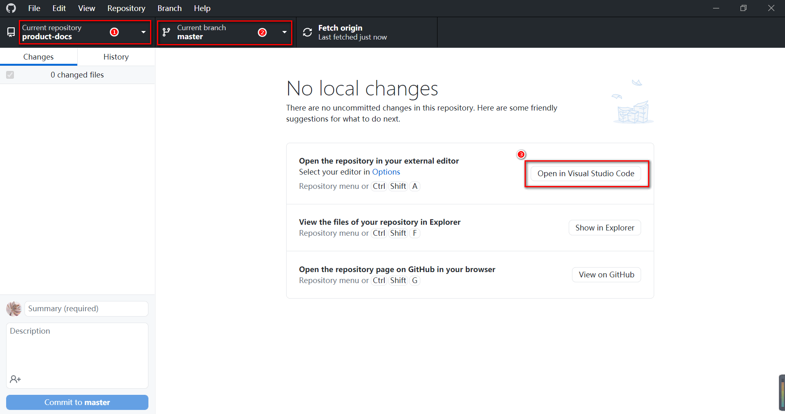

# Github + Markdown 写作环境

## 概述

本文主要介绍通过使用 GitHub Desktop 和 Visual Studio Code 工具，搭建编写 markdown 格式的文档的写作环境。

## Github Desktop

[Github  Desktop](https://desktop.github.com/) 是用 Git 做版本控制的代码托管平台，它提供了 web 界面，你可以在上面创建资源仓库来存放你的项目。

## Visual Studio Code

[Visual Studio Code](https://code.visualstudio.com/Download) 是一款代码编辑器。再加上丰富的插件库和集成 Git，可以很方便的完成从写作到发布，用它来写 markdown 格式的文章等再适合不过了。

## 基于 VSCode 搭建 Markdown 写作环境

1. 安装好 Github Desktop 后，具体的使用，可参考 [GitHub Desktop 图文教程](https://www.jianshu.com/p/a6fc842f501d)。

2. 安装好 Visual Studio Code 后，具体的使用，可参考 [使用 VSCode 编写 Markdown](https://zhuanlan.zhihu.com/p/56943330)。

3. Github Desktop 工具与 Visual Studio Code 工具关联：

    

    